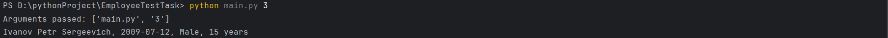

## Примеры запуска

### **Результаты выборки до оптимизации**

PS D:\pythonProject\EmployeeTestTask> python main.py 5

Arguments passed: ['main.py', '5']

ID: 1000002, Last Name: FLast0, First Name: First0, Middle Name: Middle0, Birth Date: 2000-01-01, Gender: Male

ID: 1000003, Last Name: FLast1, First Name: First1, Middle Name: Middle1, Birth Date: 2000-01-01, Gender: Male
.....

ID: 1000101, Last Name: FLast99, First Name: First99, Middle Name: Middle99, Birth Date: 2000-01-01, Gender: Male

Query executed in 0.04 seconds

### **Результаты выборки после оптимизации**

PS D:\pythonProject\EmployeeTestTask> python main.py 6

Arguments passed: ['main.py', '6']

Database optimized successfully.

PS D:\pythonProject\EmployeeTestTask> python main.py 5

Arguments passed: ['main.py', '5']

ID: 1000002, Last Name: FLast0, First Name: First0, Middle Name: Middle0, Birth Date: 2000-01-01, Gender: Male

ID: 1000003, Last Name: FLast1, First Name: First1, Middle Name: Middle1, Birth Date: 2000-01-01, Gender: Male

...

ID: 1000101, Last Name: FLast99, First Name: First99, Middle Name: Middle99, Birth Date: 2000-01-01, Gender: Male

Query executed in 0.03 seconds

## ВЫВОД:

Результаты измерения времени выполнения запроса до и после оптимизации базы данных показали, что оптимизация привела к уменьшению времени выполнения запроса.
Результаты выборки до оптимизации:

Время выполнения запроса: 0.04 секунд
Результаты выборки после оптимизации:

Время выполнения запроса: 0.03 секунд
Оптимизация заключалась в создании индексов для столбцов gender и lastName в таблице employees. Индексы позволяют базе данных быстрее находить записи по указанным столбцам, это полезно при выполнении запросов с условиями фильтрации, такими как WHERE gender = 'Male' AND lastName LIKE 'F%'.